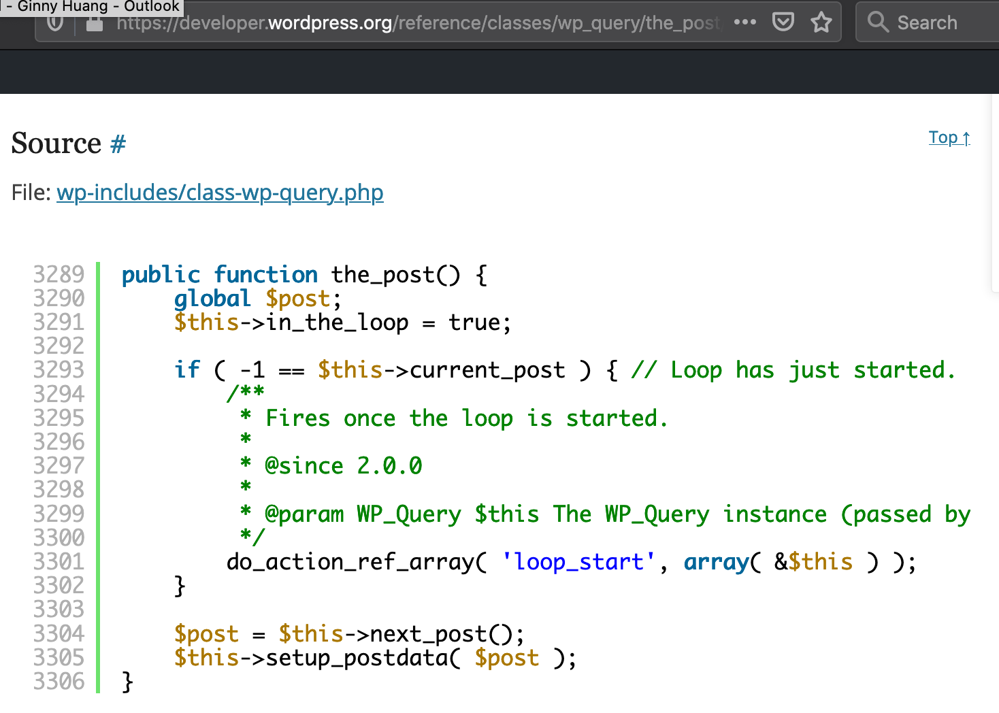

终于算是写出了我的第一个Wordpress主题，于是我觉得我终于有资格评价一下长期被群嘲（？）的php了。

总结：对于没怎么编过程的人而言应该非常贴合直觉，但对于敲了一年以上代码的人来讲……真的非常反直觉！

毕竟我自己的经验和眼界也是有局限性的，直接下结论说“这不是一个好的编程语言”未免偏颇武断。不过就我写过的这几十行Wordpress代码看来，php的思路违反了很多我上学和工作中学到并认同的coding best practices，这里做个总结。当然我总结的wordpress编程思路可能并不是php的锅而只是wordpress设计的锅，我现在就先当他们是一回事吧😂


#### 在用户不知情的情况下悄摸摸改变全局变量

这个我觉得真的不能忍——我上Computer Organization（讲CPU啊内存什么的）的时候学了点简单汇编，那会儿教授强调过“目标程序所占据的存储位置是在汇编时固定的，并且以后不能改变”——导致我把这个思路延伸到所有程序里面，认为除了函数名为动词的setter（比如set/increment/handleListener/addListener/removeListener）以外，其他任何函数都不应该改变程序里面已经被定义的变量。

那么假如我给一个博客写主页，后端返回了我10篇文章，我大概会把每篇文章看作一个object，有自己的结构什么的，然后以这种逻辑显示到主页上——


```
var post;  // 注意我清楚明白的定义了post这个变量！
while posts.have_next() {
	post = posts->next();
	echo '<h1>' + post->get_the_title() + '</h1>';
	echo '<p>' + post->get_the_excerpt() + '</p>';
}
```

而Wordpress是这么个逻辑……

```
while ( have_posts() ) {
	the_post();
	echo '<h1>' + get_the_title() + '</h1>';
	echo '<p>' + get_the_excerpt() + '</p>';
}
```

我第一眼看到这样代码的时候我就特别纳闷，`get_the_title()`和`get_the_excerpt()`是怎么知道应该读取哪一篇post的信息的呢……后来我发现了——`the_post()`这个我看着像是个getter的玩意儿，悄摸摸的设了个全局变量，然后`get_the_title()`等等也是悄摸摸的从这个全局变量里面拿信息（然后尼玛还把一个叫`$title`的全局变量改了！不能忍）。



在思考后我觉得我能够说出为什么代码这样写不好——很难查异常，很难维护，而且全局变量很容易被overwrite，等等。但我的下意识的反应却并没有这些，只是觉得——怎么那么反直觉，我只有在上学的时候才写过这种逻辑不明的代码啊！

#### 函数名无法反映函数在干嘛

这个，在我翻了一些php教程以后，觉得大概率还是wordpress的锅而不是php的，不过还是吐槽一下。

setter/getter闹不清楚。上面已经写了, `the_post()`这个让我觉得大概应该是个get函数的玩意儿，事实上改变了一个全局变量还没返回。这里再举个例子——

我上面写了`echo '<h1>' + get_the_title() + '</h1>';`，事实上我用的模版直接是这么写的：`the_title('<h1>', '</h1>')`。

把tag name作为参数传进去这个我觉得没问题，要命的是`the_title`给我的感觉，和`get_the_title`是没什么区别的呀。结果`the_title`做了以下两个让我难以理解的事情——

1. 改变`$title`这个全局变量的值
2. `echo get_the_title('<h1>', '</h1>')`

后来我看了源代码以后发现其实是这样的——`function the_title( $before = '', $after = '', $echo = true )`

所以说其实`echo`是否执行，取决于是否第三个参数有被设置为`false`。如果这个参数被设为false它就是个get function，被设为true或者没被设，它就直接把这个值`echo`到html页面里……

```
if ( $echo ) {
    echo $title;
} else {
    return $title;
}
```

反正我敢说，要是我上班的时候提交这样奇特的代码，肯定过不了code review...

------

虽说这些代码的思路让我觉得瞠目结舌，但是又有点难以名状的熟悉感。后来我明白了，我上班前写的代码和这个贼像——不考虑模块化，不考虑可读性可维护性，靠那个时候的直觉写出来的代码真的长这样。我想这也是为什么大家都说“php很容易上手“吧。

下面这是我CS 111的作业……那会儿我还没学数据结构。我居然还能找到这样的历史资料，不愧是我啊哈哈哈哈哈

```
"""
GINNY HUANG (I don't wanna be taken off points b/c this again!)
CS111
Problem Set 3: Complete the appropriate function definitions
See prog3.pdf link on the course schedule.
"""

import random

"""
Describe the function here:
1.The user inputs the range.
2.count=0
3.guess u=(l+h)/2
4.if user say high, then u=(u+l)//2;if user say low, then u=(u+h)//2.
5.count += 1
"""
def guess():
    print('Hello. In this guessing game I will guess a number you have selected.')
    l,h=input('What is the range from which you will select (low hi):').split(' ')
    l=int(l)
    h=int(h)
    count = 0
    u = (1+h)//2

    g=input('Is it ' + str(u) + '[y/n]?')
    while g == 'n':
        s = input('Was ' + str(u) + ' hi or lo?')
        if s == 'hi':
            h = u - 1
        else:
            l = u + 1
        u = (l+h)//2
        count += 1
        g = input('Is it ' + str(u) + '[y/n]?')
    count += 1
    print('Yea!!! I guessed it in ' + str(count) + ' tries!\nThanks for the fun.')

    

"""
Describe the function here: Suppose the number is 100.
...
"""
def dec2oct():
    ... # 略了，和上面那个差不多

"""
main: This is the main function, where the user is repeatedly asked which of the
above programs to execute. When the user enters an invalid choice, the program
will quit.
"""
def main():
    while True:
        choice = input("Please choose from 'guess', or 'dec2oct'\n" \
                       + "to run the appropriate program (nothing to quit): ")
        if len(choice) == 0 or choice not in ['guess', 'dec2oct']:
            break

        eval(choice + "()")
        print()
    print("Thank you.\n")

main()
```

（等等，为什么那个时候我会用eval...一定是叫兽教我的！）

### 番外：其实我还想吐槽MailChimp来着

有朋友表示希望能用邮件订阅这个博客，感到莫大荣幸的我决定去研究一下subscription的实现。网上随便搜索了一下，看到最多的词是Jetpack和MailChimp，然后很多人表示“后来我不用Jetpack而转投MailChimp了”加上我很久之前实习的公司也用MailChimp来着，于是就决定试一下。

然而我天真的以为MailChimp就是个简单的plugin，用`npm install`就能搞定的那种……事实证明我又太天真了！这个服务很全套很复杂而且基本不太需要动代码的啊……能感觉到对于运营人员这玩意儿真的非常好用，然而对我而言就很复杂了😭

首先，我到现在也没找到有什么合适的方法可以在不多交钱的情况下，用一个账号管理三个博客（还好我目前还没有三个博客，但以后就难说了）。我知道通过隐藏tag可以搞清楚“用户是从我哪个博客订阅的”，但是万一有谁同时订阅了我两个博客，我就找不到方法自动去给这样人归类了……

其次，本来我希望得到的效果是“点击一个按钮，跳出一个弹窗可以让用户进行订阅”的，结果Subscriber pop-up只支持“第一次打开主页就直接打开弹窗让用户订阅”。我通过改代码倒是实现了“通过点击按钮打开弹窗”的功能，可是还是绕不过“第一次打开主页”这个限制（也就是用户只有清空缓存后第一次点那个按钮，才会跳出弹窗让人订阅，第二次点就不行了）。发现这点后我也懒得和它磨了，最后还是只能靠Embedded forms从头做了个订阅功能（如果我有那个闲工夫的话应该还是可以做成弹窗，不过……好吧，还是懒😂）

在推上吐槽了两句MailChimp以后有老司机来推荐mailgun，看来下回我应该试试这个……
