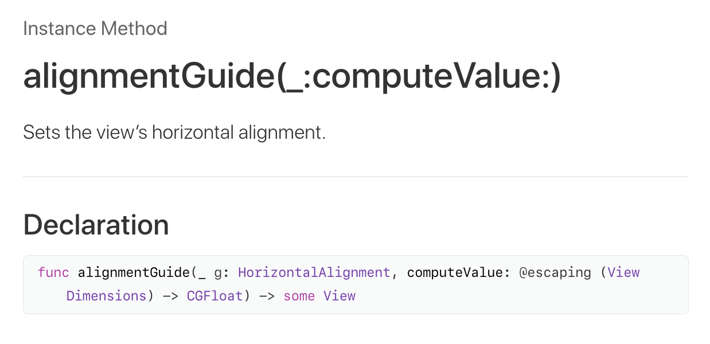

当了五年码农，好像这是我第一篇业余时间写的技术干货（如果可以这么说的话……）或者说技术流水账。~~不过相比之下，当了将近五年移动端程序猿，到现在都还没有上架过app好像更羞耻😂希望两周内也能终结这个记录吧~~ 哦耶当了五年移动端程序猿还没上架过app这个记录终于终结啦啊哈哈哈哈

先说说我为什么掉了SwiftUI的坑。首先我工作虽说有一大部分内容是原生iOS开发，但开发的是工具包而不是应用。然后除了工作之外，我仅有的两次iOS应用开发经验如下

1. 基本靠复制粘贴搞定的大四的期末project，每次排版我都得算半天数，脑子转不过来
2. 毕业后为了找工作，基本也是根据课本拼出了一个[只有bug没有功能的吃饭记录app](https://github.com/huangginny/Where-To-Eat)，为了避免排版的时候要疯狂算数我就用了Storyboard，结果肠子都悔青了——设各种constraints实在太难了，好不容易颤颤巍巍做到能看了，一升iOS 8又全毁了……重点来了，这app我写来是主要是为了求职的，然后面试的时候对面的大帅比面试官，现在已经是我老板了，拿出他的手机打开我那个app跟我说我哪哪哪写错了该怎么改，还说他帮我改了俩bug后才成功编译的😂

1月初有个不错的想法想赶快实现，回到家马上升级了私人电脑上尘封已久的XCode。建立新项目的时候默认的选项是SwiftUI。鉴于我不想用Storyboard也不想在ViewController里面绞尽脑汁算数，又觉得用新玩意儿好像比较适合装b，也没多想就建立了一个新的SwiftUI project。大概不到3周，[app终于初步完成](https://github.com/huangginny/Dionysa)，现在已经进入内测阶段，这里写一下SwiftUI的使用感受也汇总一下我踩过的坑。

总结：大方向不错，不过还是等发展好一点再用吧。

### Pros

SwiftUI最大的优点是排版真的太爽太方便了。避开了纯代码排版在数学和逻辑上的烧脑，但树状结构的排版方式又和程序猿的思路不谋而合（不像Storyboard感觉更像职业设计师用的）。感觉很像更好用版的css-grid，当然手机/平板对于自适应的要求好像也确实没有web那么高就是了……

首先，**VStack和HStack，**易懂易上手就不说了，关键是这种横竖切块的思路实在简单粗暴，脑子里画好的UI可以马上反应成代码。比如说以下这么个东西——（左边一个大方块，右边算上分割线总共四行，第二行一部分字左对齐一部分右对齐）


用Flexbox/cssgrid之类的也不难写，但是我没有把握能一次性写对（可能是我太弱鸡……）。用SwiftUI绝对能保证一条过
```
HStack {
	ScorePercentile(86)
	VStack {
		ScoreBar(86)
		HStack {
			Text("8.6 / 10 by 649 users")
			Spacer()
			Text("$$")
		}
		Divider()
		Image("powered-by-foursquare")
	}
}
```

**神奇的Spacer()**也非常好用。官方解释是A flexible space that expands along the major axis of its containing stack layout，那意思就是在屏幕范围内，有多长伸多长了。

比如说

- 居中 `Spacer() Text("Hello world") Spacer()`
- 一部分左对齐一部分右对齐 `Text("Hello") Spacer() Text("World")`
- 好了稍微复杂一点的，一部分左对齐，另一部分放在剩下部分的中间 `Text("Title:") Spacer() Text("Hello world") Spacer()` 当然每一个元素的宽高也可以写死在代码里

还有一个排版神器就是GeometryReader，官方解释：A container view that defines its content as a function of its own size and coordinate space. 说的不明不白的，不过我感觉大概用法就是，当你懒得算你目前这个view的宽/高，但你又需要这两个数的时候，就可以用它来取值，就不用自己算了。类似这样的
```
VStack {
	Image("对不起我也不知道我多大")
	Image("我必须要是剩余面积的4/9大").resizable().frame(width:要自己算,height:要自己算)
}
```
用了GeometryReader就可以轻轻松松变成这样，皆大欢喜
```
VStack {
	Image("对不起我也不知道我多大")
	GeometryReader { geometry in
		Image("我必须要是剩余面积的4/9大")
			.resizable()
			.frame(width:2/3 * geometry.width, height:2/3 * geometry.height)
	}
}
```
不过这个GeometryReader我有点拿不准是怎么个编译原理，也不知道geometry是何时生成怎么生成的，关键词它总是能引入一些奇奇怪怪的bug。比如说我之前在ScrollView里面加了个GeometryReader，结果不知道为什么再里面的子元素全都被拉地比屏幕宽一点，只要把GeometryReader套到ScrollView外面就修好了。还有一次本来我好好写了个Navigation，结果在Navigation外面一套上GeometryReader，每次我从details view退出来以后就发现NavigationView里面的列表不明原因重新加载了一遍，非常奇怪。

其次，Swift这个语言本身还蛮好用。简洁方便又是强类型，optional和required分的很清楚，但是optional chaining又能够减轻强行类型转换带来的风险。这种便利是我用过的其他编程语言里面都没有的。还有就是Playground非常好用（虽然和Xcode其他功能一样慢的一笔……）再其他的就没什么了。

### Cons

目前SwiftUI的坑还是非常多的，多到我觉得如果让我重新做这个项目，我大概还是会老老实实的写ViewControllers。根源就在于这个语言真的还是处在小白鼠阶段啊，UIKit有的功能它大概连三分之一都没有啊！具体有哪些坑我列举一下

#### 1. 基本不能自定义行为。

最简单的，用UIKit+ViewController非常容易做到的，在某一个View下面改变status bar字色。用SwiftUI我到目前还没找到一个不用把我整个项目推翻重写的办法来做到这点……

然后再举个例子。有一个输入框，你希望你输入的时候，键盘的回车键上面写的是"Search"，然后点search会触发什么行动。用UIKit一行就搞定了的事儿，结果因为SwiftUI textfield没办法预设UIReturnKeyType，于是我不能使用SwiftUI自带的TextField，一定要用UITextField并且自己写个UIViewRepresentable来包装。然后为了能够监听回车键，我又多写了个UITextFieldDelegate……也就是说，为了这么简单一个功能，我tm足足写了三个类，感觉上特别冒傻气有木有！

当然我现在回去看看我的笔记，好像是有更好的办法实现这一点。之前我试过在init里面调用`UITextField.appearance().keyboardAppearance.returnKeyType = UIReturnKeyType.search`，不过说必须要在main thread上执行。我试了以后好像又报了个什么别的错，我也不记得了，总之这个方法没成功。

还有个常见情景，tab view包navigation view。这里我需要做两件事情——
1. Tab1进入navigation details view，点tab2再点回tab1，我还是应该看到之前看的details view
2. Tab1顶上覆盖status bar而tab 2不覆盖

SwiftUI自带的tab可以实现这两个中的任意一个，然而不能同时做到这两者。因此我只能继续用UITabBar并且多写了两个类来适配它……

最后再举个例子——https://stackoverflow.com/questions/59279176/navigationlink-works-only-for-once 教程上给出来的代码，用Simulator跑都能跑出bug...

#### 2. 没文档

虽然SwiftUI官方教程对于初学者入门还挺友好的，但是API文档简直是……除了函数名以外什么都没有！名字起得不好或者用法比较复杂的函数，看文档是真的完全看不出来它是干什么的啊！比如说VStack/HStack的alignmentGuide。很多民间文档带文字解释还有示范代码的，我尚且理解的云里雾里的，感受一下官方解释……



反正我是输了……

连这种简单的文档都没有，那就更不用提复杂一些了。比如说app从后台回来以后，重新打开navigation里的某个detail view是怎么个程序啦，会不会调用onAppear，怎么把缓存的数据往里灌啦，统统搞不定。我只知道view.onAppear()没有再被调用，剩下的也只能交给它了。

#### 3. Previewer实在太慢！

一开始发现Xcode上面有previewer我觉得很方便，后来发现真的每次要更新界面都要至少两分钟，还不如直接重新在Simulator上编译一遍……那你开发这么个功能干个球！？

### 记踩过的坑

1. 改输入框的return key，上面已详述
2. edgesIgnoreUnsafeAreas该怎么用啊救命——我一个tab view有三个tab，第一个tab里面有个navigation view，然后这个navigation stack里的其中一个view需要饱含顶上status bar……（最后好像是把navigation view和它的parent view的这个参数设成true了，不过我到现在也不知道原理几何）
3. Identifiable. 首先SwiftUI规定了只有Identifiable protocol才可以遍历，也就是说这个struct需要一个id property。但是它又没什么用，所以我一开始是这么写的

```
// Model.swift
struct PlaceInfoModel : Identifiable {
    static var instanceCounter = 0
    var id: Int {
        PlaceInfoModel.instanceCounter += 1
        return PlaceInfoModel.instanceCounter
    }
    var name: String
    var rating: Double

// ModelView.swift
List(self.state.placeInfoModels) { result in
    NavigationLink(destination:
        PlaceView(result)
    ) {
        PlaceRow(result)
    }
}
```

结果self.state.placeInfoModels的变化无法反映到UI上。原因——每次哪个model有了变化，这个model的ID其实都会更新一遍，而这个List并没有监听新的ID……
这个问题其实不难解决，我后来发现可以直接用Foundation里面的UUID()就不用自己拿instance counter算了。但是当时查找问题真的查了好半天。

4.机型适配。理论上，你的UI有两种宽度（compact & regular）和两种高度（同前）。程序通过调用UserInterfaceSizeClass来检测目前的宽高，并且根据是compact还是regular来决定排版（比如说宽度为regular的话用双列排版）
然后我发现，每次我旋转iPhone 8P的时候排版都会乱掉。查了一整夜终于发现了这么个文档，官方的：[Adaptivity and Layout](https://developer.apple.com/design/human-interface-guidelines/ios/visual-design/adaptivity-and-layout/)

然后发现了原因——8p, Xr, Xs Max都有这个问题，就是竖版是compact width regular height，横版刚好是regular width compact height...然后对于device orientation的处理，对于这几种机型来说好像是有已知bug的。怪不得那么多app在手机上都不支持横版，我一气之下也干脆把横版给省了。

还有踩了很多坑，不过后来证明是我自己没好好读文档和sample app代码，就不详述了。

------

最后感慨一句，iOS开发现在比几年前还是简单多了。以前我各种证书都搞不定，这次基本上直接用XCode给我生成的证书发布了beta版。而且开发全程我基本没动Info.plist，换了以前我想都不敢想啊。
